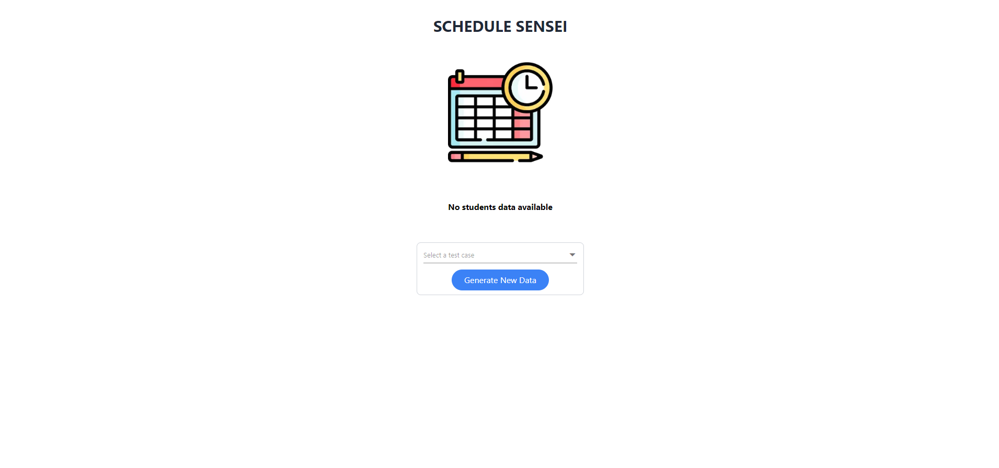

# ReadMe

# CISC/CMPE 204 Modelling Project

The aim of this project is to create a logical model that allows a student to input a tentative course schedule and assess its feasibility. The model will consider various factors, including course prerequisites, and time conflicts. By applying principles of natural deduction, the model will attempt to evaluate a feasible solution satisfying all constraints and ensuring all necessary requirements are met.

## Structure

***Folders***

- `documents` Contains both draft and final submissions.
- `data` Contains both test and main data sets from [qmulus](https://github.com/queens-qmulus/datasets).
- `webapp` Contains a Nextjs web app to view and interact with generated timetable solutions.

***Files***

- `run.py`General wrapper script to execute the sat solver.
- `sat_solver.py` The Python SAT solver constraint and proposition models, as well as compile and solve functions.
- `datalayer.py` Defines classes for representing Queens courses, departments, requirements, and sections, as well as collections of these elements.
- `timetable.py` Defines timetable classes and JSON Serialization functions.
- `webapp_api.py` Defines a Flask API for parsing requested SAT solver test cases.
- `utils.py` Contains utility classes and functions for the timetable scheduling SAT solver.
- `test.py` Submission requirements and theory size checks.

## Running With Docker

By far the most reliable way to get this project running is with [Docker](https://www.docker.com/). This section runs through the steps.

1. First, download Docker https://www.docker.com/get-started
2. Navigate to your project folder on the command line.
3. We have created a bash script `model.sh` to help you build and run the project given your desired preferences. **(Web App and Console modes)**
4. Our script **requires jq**, a json processor. It can be installed by running `sudo apt install jq` in your console.
    
    ### **Using the Web App**
    
    If you would like to run the *Python SAT Solver* and use the *Nextjs Web App* for interaction with the Solver: 
    
    *From the project folder run to following commands.*
    
    1. `./model.sh --build` builds both the Sat Solver and the Web App containers.
    2. `./model.sh --start` starts both the Sat Solver and the Web App
    3. The Web App can be accessed at [http://localhost:3000/](http://localhost:3000/)
    4. To stop both the Web App and the Sat Solver, you can `Ctrl+C` in the terminal to interrupt and shut down both containers. Running `./model.sh --shutdown` is also an option if your terminal is not tied up.
    5. From the shutdown state both the Sat Solver and the Web APP containers can be restarted with `./model.sh --start` followed by `./model.sh --run` to run both programs.
    
    ### **Using the Console**
    
    If you would like to run the *Python SAT Solver* and use the *Console* for interaction: 
    
    *From the project folder run to following commands.*
    
    1. `./model.sh --build --console` *builds the Sat Solver container*
    2. `./model.sh --start --console` *starts the Sat Solver*
    3. The Sat Solver can then be used through the terminal.
    4. To stop the Sat Solver, you can `Ctrl+C` in the terminal to interrupt and shut down the container. Running `./model.sh --shutdown` is also an option if your terminal is not tied up.
    5. From the shutdown state the Sat Solver container can be restarted with `./model.sh --start --console` followed by `./model.sh --run --console` to run the program.
    
    **Alternative Using Docker Compose**
    
    *More complicated*
    
    1. Running `docker-compose up -d`  will build the Python SAT Solver image `sat_solver_204` as well as the Nextjs Web App `web_app_204` image as well as create and start both containers.
        
        Note that the -d option is important as it runs the command in the background to avoid tying up the terminal, preventing further commands from being run.
        
    2. From there the two containers should be connected. Both containers share a local network `webapp_network` for HTTP communications. The SAT Solver container project directory is also linked to the local project folder so that everything you do in one automatically updates in the other.
    3. **IMPORTANT** You must ensure your desired preferences exist in the `config.json` file if using this method, otherwise the app may run in console mode as a background process, or vise versa.
    4. **Web App Mode**
        1. To start the Nextjs Web App you must run
            
            `docker exec -d $(docker-compose ps -q web_app_204) npm start`
            
            ***This executes `npm start` in the web_app_204 container as a background process*
            
        2. To start the Python Sat Solver you must run
            
            `docker exec -d $(docker-compose ps -q sat_solver_204) python3 run.py`
            
            **************This executes `python3 [run.py](http://run.py)` in the sat_colver_204 container*
            
        3. The Web App can be accessed at [http://localhost:3000/](http://localhost:3000/)
        4. To stop both the Web App and the Sat Solver, you must shutdown the containers using the Docker Desktop GUI or by running:
            
            `docker-compose stop $(docker-compose ps -q web_app_204)` *stops the Web App*
            
            `docker-compose stop $(docker-compose ps -q sat_solver_204)` *stops the SAT Solver*
            
    5. **Console Mode**
        1. To start the Python Sat Solver you must run
            
            `docker exec -it $(docker-compose ps -q sat_solver_204) python3 run.py`
            
            **************This executes `python3 [run.py](http://run.py)` in the sat_colver_204 container*
            
        2. To stop both the the Sat Solver, you can enter `e` as input, to shutdown the containers you can use the Docker Desktop GUI or run:
            
            `docker-compose stop $(docker-compose ps -q sat_solver_204)` *stops the SAT Solver*
            
    
    ## Usage
    
    **Web App Mode**
    
    After running the project in the Web App Mode and visiting the home page [http://localhost:3000/](http://localhost:3000/) you will be greeted with a blank page with no student data, as no tests have been ran.
    
    
    
    Selecting the drop-down reveals pre-configured test cases, that can be selected and ran in the Sat Solver using the *“Generate New Data button”*.
    
    
    
    After generating the solution the page will refresh and a table containing students and there enrolled terms will appear. A students term schedule can then be viewed using the *“view”* button located in the table.
    
    
    
    A specific students time table may resemble the following
    
    
    
    **Console Mode**
    
    After running the project in Console Mode the following message will be displayed in the console
    
    
    
    This prompt accepts user input for a *test case id*. After entering a case the solution is directed to the console.
    
    
    
    The Console Mode remains in a while loop repeatedly asking for user input until the `e` key is entered closing the program.
    
    ## Contents
    
    ## Uninstall
    
    To remove all docker containers, volumes, and networks used by this project you can run
    
    `./model.sh —uninstall` if you wish to use our script
    
    OR
    
    `docker-compose down --volumes --rmi all`
    

[ReadMe](https://www.notion.so/ReadMe-5954b8d933b54eb6a9b98034acf9775c?pvs=21)

